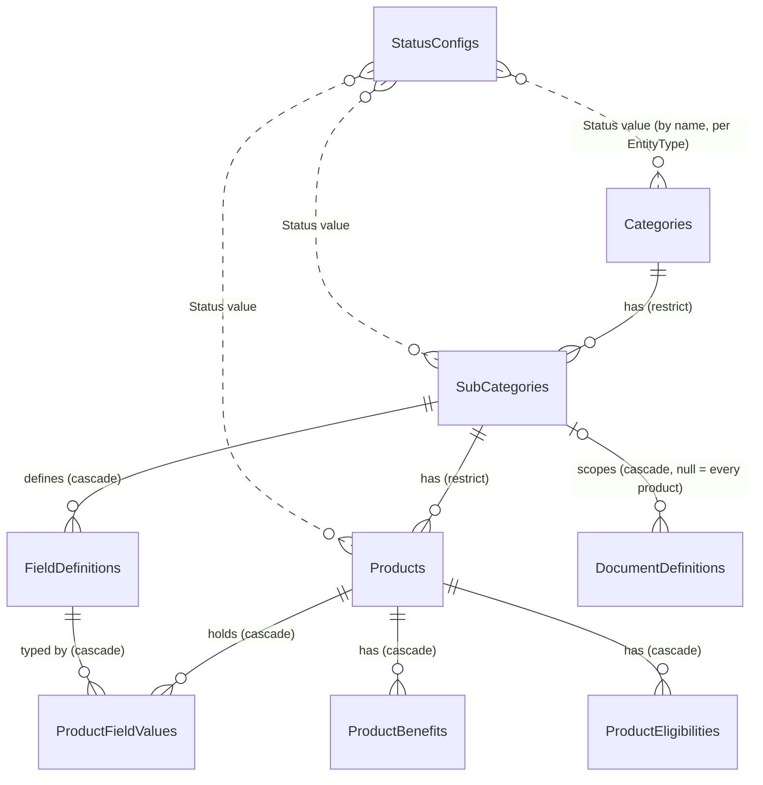
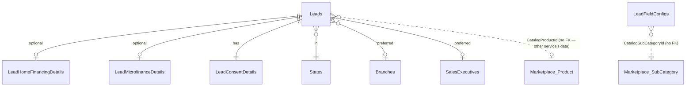

# Products & Marketplace rebuild — implementation report

Written 2026-09-30, on local branch `products-rebuild` (17 commits ahead of `main`, **not pushed**).
Companion documents in this folder: [PROGRESS.md](PROGRESS.md) (state, verification log, API contract),
[BRIEF.md](BRIEF.md) (your original request and the plan), [CODEBASE-FACTS.md](CODEBASE-FACTS.md) (what the old
code looked like), and the four mockups.

---

## 1. The answer to your question

> *"Did you build a connection between the Product Marketplace and Lead Management, so that the product a lead is
> created for comes from the Product Marketplace only?"*

**Yes. It is built, and it was tested end to end.**

Before this work it did **not** exist: Lead Management kept its own private list of seven hard-coded products
(a table filled by a migration) and matched the product *name* the browser sent against it. A product you created in
the Marketplace never appeared in the lead form.

Now:

1. **Create Lead** opens with **"Please select a category"** — the categories are read live from the Marketplace.
2. Clicking a category shows **its products** (again from the Marketplace, with the sub-category under each name).
3. Clicking a product opens **the same lead form as before** — customer details, sales executive, consent — and the
   rest of the process (validation, approval, audit, list, edit, delete, dashboard) is unchanged.
4. When the lead is saved it stores **which Marketplace product it is for** (the product's id) **plus a snapshot** of
   the product, sub-category and category names and codes at that moment.
5. **Marking a category (or sub-category, or product) inactive removes it from the lead form** — you don't change any
   code, and nothing beneath it is rewritten. A lead can't be filed against something that is no longer offered, even
   from a form that was opened before it was switched off. Switch it back on and it returns exactly as it was.

What I ran to prove it is in [§8](#8-what-was-verified-and-what-was-not).

```mermaid
sequenceDiagram
    autonumber
    actor U as Lead user
    participant L as lead_mf (browser)
    participant LS as LeadService
    participant PS as ProductsService
    U->>L: Create Lead
    L->>LS: GET /api/catalog/categories   (user JWT, lead permission)
    LS->>PS: GET internal/catalog/categories   (X-Internal-Api-Key: catalogue key)
    PS-->>LS: only categories with ≥1 visible product
    LS-->>L: categories
    U->>L: picks "Loans"
    L->>LS: GET /api/catalog/categories/{id}/products
    LS->>PS: GET internal/catalog/categories/{id}/products
    PS-->>L: products (via LeadService)
    U->>L: picks "Home Loan – Salaried"; fills the form; Submit
    L->>LS: POST /api/leads { catalogProductId, …customer details… }
    LS->>PS: GET internal/catalog/products/{id}   (never cached)
    alt product still visible
        PS-->>LS: product + sub-category + category
        LS->>LS: load lead form rules for that sub-category, validate, save lead + snapshot
        LS-->>L: 201 Created
    else withdrawn / category switched off
        PS-->>LS: 404
        LS-->>L: 400 "That product is no longer offered"
    else Marketplace unreachable
        LS-->>L: 503 "catalogue not reachable, could not confirm the product"
    end
```

---

## 2. What was built, phase by phase

| Phase | What | State |
|---|---|---|
| 1 | **ProductsService rebuilt** — new schema, APIs, validation, approvals, audit, statuses. Old tables, data, seed and dead code removed. | Done, verified on real PostgreSQL |
| 2 | **Products & Marketplace remote rebuilt** to the four mockups — Dashboard, Products (cards), Categories, Sub-categories, Setup (Fields / Documents / Statuses), Audit Logs — on the shared `@omniconnect/ui` library, nothing hard-coded. | Done, verified in a browser, and now in the real host |
| 3 | Dashboard and audit screens | Done (built with Phase 2) |
| 4 | **Marketplace → Lead Management link** (this report's §1) | Done, verified |
| — | Remaining verification gaps from Phases 2/3 (Setup → Documents, Fields add/delete/format, real host shell) | Closed this session |

### Why the model is Category → Sub-category → Product (your question about sub-categories)

| Level | What it is | Example |
|---|---|---|
| **Category** | A line of business — navigation and reporting | Loans, Credit Cards |
| **Sub-category** | A **type** of product. It owns *what every product of that type carries*: the attribute definitions (rate, tenure, fees…), the documents required, and — new in Phase 4 — **the lead form** | Home Loan, Personal Loan, Cashback |
| **Product** | A specific **offering** a customer can take | Home Loan – Salaried, Home Loan – Self Employed |

Sub-category is worth having (and is not the same thing as a product) because **the configuration belongs to the type,
not to each offering**. Two home-loan products ask for the same property papers and show the same fields; you
configure that once on "Home Loan". Without that layer you would either repeat the configuration on every product or
pile it onto the category (where a car loan and a home loan would have to share it). The earlier code had two parallel
classifications ("ProductType" and a half-built sub-category); they were collapsed into this one.

### Marking a category inactive — how it works

Nothing is copied down. A product is **visible only when its own status, its sub-category's status and its category's
status are all "live"** — and "live" is a flag an administrator sets per status in **Setup → Statuses**, not the word
"Active". Every query that shows the catalogue uses this one rule.

```csharp
// Backend/ProductsService/src/ProductMarketplace.Infrastructure/Services/CatalogVisibility.cs
public IQueryable<Product> Visible(IQueryable<Product> products)
{
    var live = _products; var liveSub = _subCategories; var liveCat = _categories;
    return products.Where(p =>
        live.Contains(p.Status)
        && liveSub.Contains(p.SubCategory.Status)
        && liveCat.Contains(p.SubCategory.Category.Status));
}
```

The tempting alternative — writing "Inactive" onto every product under the category — destroys what each product was:
a deliberate draft would come back live when you reactivate. With the derived rule, reactivating restores every
product exactly as it was (a test pins this: `Reactivating_a_category_restores_each_product_exactly_as_it_was`).

---

## 3. The Marketplace → Lead link in detail

### 3.1 ProductsService side — the catalogue, published for other services

[`Controllers/InternalCatalogController.cs`](../../../Backend/ProductsService/Controllers/InternalCatalogController.cs)

| Endpoint | Returns |
|---|---|
| `GET internal/catalog/categories` | live categories that have ≥ 1 visible product, with the count |
| `GET internal/catalog/sub-categories` | visible sub-categories (with their category) — for Field Settings tabs |
| `GET internal/catalog/categories/{id}/products` | visible products in a category, with sub-category and category |
| `GET internal/catalog/products/{id}` | one visible product with its full position; **404 if it is not visible** |

Implemented by [`CatalogLookupService.cs`](../../../Backend/ProductsService/src/ProductMarketplace.Infrastructure/Services/CatalogLookupService.cs),
which reuses `CatalogVisibility` — so the lead form and the Products screen can never disagree about what is visible.

**Security.** Guarded by [`InternalCatalogKeyFilter`](../../../Backend/ProductsService/Infrastructure/Security/InternalApiKeyFilter.cs)
using its own secret, `Internal:CatalogApiKey`. It is deliberately **not** the key AuthService uses to replay approved
changes: a service that only needs to read product names must not be able to apply approvals. Tests prove each key opens
only its own door, and that the catalogue answers 503 until its key is configured.

### 3.2 LeadService side

| File | Role |
|---|---|
| [`Infrastructure/ProductCatalogClient.cs`](../../../Backend/LeadService/Infrastructure/ProductCatalogClient.cs) | Typed HTTP client to the endpoints above. **Two failure modes on purpose** — see below. |
| [`Controllers/CatalogController.cs`](../../../Backend/LeadService/Controllers/CatalogController.cs) | `GET /api/catalog/categories`, `…/categories/{id}/products`, `…/sub-categories` for `lead_mf`. Requires a lead capability, so a lead user needs **no** permission in the Marketplace. |
| [`Services/LeadService.cs`](../../../Backend/LeadService/Services/LeadService.cs) | Create/Update resolve the product through the client, store id + snapshot, look up the lead-form rules by sub-category. |
| [`Services/LeadFieldConfigService.cs`](../../../Backend/LeadService/Services/LeadFieldConfigService.cs) | Field Settings keyed by sub-category; defaults created on first use. |
| [`Models/Entities/LeadEntities.cs`](../../../Backend/LeadService/Models/Entities/LeadEntities.cs) | `Lead` gains `CatalogProductId` + snapshot columns; the `ProductId` foreign key is gone. |
| [`Migrations/…_ConnectToProductCatalogue.cs`](../../../Backend/LeadService/Migrations/20260930071138_ConnectToProductCatalogue.cs) | The schema change, with a data-preserving order (below). |

**Two failure modes, on purpose.**

- *The pickers* (category and product lists) are cached for 30 seconds and, if the Marketplace can't be reached, fall
  back to the last list read — a brief outage should not blank the form.
- *Filing a lead* re-asks the Marketplace about that exact product **every time, uncached**. It either confirms the
  product, or says it's gone (400), or — if it can't ask — refuses with **503**. A lead is never filed against a
  product nobody could confirm.

```csharp
// Services/LeadService.cs — the gate in front of every new lead
private async Task<CatalogProduct> ResolveProductAsync(Guid catalogProductId)
{
    if (catalogProductId == Guid.Empty)
        throw new InvalidOperationException("Product selection is required.");

    return await _catalog.GetProductAsync(catalogProductId)
        ?? throw new InvalidOperationException("That product is no longer offered. Please choose another product.");
}
```

**Editing.** A lead keeps its product. Sending its own id (or none) changes nothing and asks nothing of the
Marketplace, so a lead for a product that has since been withdrawn — or one taken before this link existed — is still
editable. Only choosing a *different* product is confirmed with the Marketplace.

**The snapshot.** `ProductName`, `ProductCode`, `SubCategoryName/Code`, `CategoryName/Code` (and the three ids) are
copied onto the lead when it is taken. Lists, search, the product filter, exports and the dashboard read the
snapshot, so renaming or withdrawing a product never rewrites history. A rename does **not** change existing leads.

**The lead form per sub-category.** `LeadFieldConfig` (label, visible, required, editable, order, masking, formats) is
now keyed by `CatalogSubCategoryId`. The first time a sub-category is used it gets the default set; every
"Home Loan" product then shares one form. The property/business fields (`propertyType`, `propertyStatus`,
`dateOfIncorporation`, `companyName`, `entityType`) exist for every sub-category but start **hidden and optional**;
you switch on the ones a sub-category needs in **Lead → Field Settings** (one tab per sub-category). Nothing looks at
a product's *name* to decide what to show — the old `if product == "Home Financing"` branches (in the API, the
seeder, the edit drawer and the filter) are all gone.

### 3.3 lead_mf (the browser side)

| File | Change |
|---|---|
| [`components/lead/ProductPicker.tsx`](../../../Frontend/apps/lead_mf/src/components/lead/ProductPicker.tsx) (+ `.module.css`, `.test.tsx`) | **New** — the Category → Product picker, used by the Create form *and* the Edit drawer. Handles loading, empty ("no products yet"), failure (with Try again), and "Keep current product". Replaces the old flat dropdown `ProductSelector.tsx`. |
| [`api/apiClient.ts`](../../../Frontend/apps/lead_mf/src/api/apiClient.ts) | Catalogue calls (never cached, and they *throw* on failure so an outage isn't mistaken for "nothing on offer"); `toLeadPayload` sends the product as its id only. |
| [`store/useLeadStore.ts`](../../../Frontend/apps/lead_mf/src/store/useLeadStore.ts) | Form carries `catalogProductId` + `subCategoryId`; field settings load by sub-category; the product filter's options are the products leads actually exist for. |
| `components/lead/{LeadFormContainer,EditLeadDrawer,LeadDetailsDrawer,LeadFilterPopover}.tsx`, `pages/{FieldSettingsPage,ViewLeadPage}.tsx` | Product-name checks and the hard-coded fallback product list removed; sections shown from the field configuration (`hasVisibleField`). |

---

## 4. Code map — everything that was built

Paths are relative to the repository root.

### 4.1 ProductsService (`Backend/ProductsService`, clean architecture)

| Area | Files |
|---|---|
| Domain | `src/ProductMarketplace.Domain/Entities/{Category,SubCategory,Product,FieldDefinition,DocumentDefinition,StatusConfig,ProductFieldValue,ProductBenefit,ProductEligibility,AuditLog,SearchLog}.cs` |
| Application | `src/ProductMarketplace.Application/{Interfaces/IServices.cs, Dtos/*, Common/*}` (incl. `CatalogLookupDtos.cs`) |
| Services | `src/ProductMarketplace.Infrastructure/Services/{CategoryService,SubCategoryService,ProductService,ProductValueValidator,DashboardService,StatusConfigService,DocumentDefinitionService,StatusValidation,CatalogVisibility,CatalogLookupService,CatalogSupport,Mapping}.cs` |
| Data | `…/Data/{AppDbContext.cs, Configurations/EntityConfigurations.cs}`, migrations `20260930032147_InitialCreate` and `20260930032217_BootstrapStatuses` |
| API | `Controllers/{Categories,SubCategories,Products,Dashboard,DocumentDefinitions,StatusConfigs,AuditLogs,InternalApprovals,InternalCatalog,Permissions}Controller.cs`, `Program.cs` |
| Platform contract | `Infrastructure/Security/*` (JWT, capabilities, the two internal-key filters), `Infrastructure/Approvals/ProductsMutations.cs`, `Services/CentralAuditForwarder.cs`, the capability and navigation manifests |
| Tests | `Backend/ProductsService.Tests/*` — **289 tests** (visibility, each service, statuses, permissions, endpoint security incl. both key filters, approvals & audit, the catalogue lookup) |

### 4.2 Products & Marketplace remote (`Frontend/apps/products_and_marketplace_mf`)

Six screens — `pages/{dashboard,products,categories,subcategories,setup,audit}` — built from `components/*` and the
shared `@omniconnect/ui`; one store per resource (`stores/*`, `createPagedStore` for lists); one thin API module per
resource (`services/*`); `hooks/useSaveAction` handles "applied / refused / held for approval"; permissions in
`permissions/permissions.ts`. The product form builds one input per **field definition of the chosen sub-category**
(`ProductFormDrawer` + `ProductFieldInput`), so adding an attribute in Setup → Fields adds it to the form and the card
with no code change. **130 unit tests**; type-check, build and lint clean. Its own [README](../../../Frontend/apps/products_and_marketplace_mf/README.md) describes the structure.

### 4.3 LeadService (`Backend/LeadService`) — Phase 4

Added: `Controllers/CatalogController.cs`, `Infrastructure/ProductCatalogClient.cs`, `Options/ProductsIntegrationOptions.cs`,
migration `20260930071138_ConnectToProductCatalogue`. Changed: `LeadService.cs`, `LeadFieldConfigService.cs`,
`DashboardService.cs`, `LeadFieldConfigController.cs`, `LeadsController.cs` (`GET api/leads/product-names`),
`InternalApprovalsController.cs`, `MasterDataService.cs`/`MasterControllers.cs` (products removed), `ApplicationDbContext.cs`,
`LeadEntities.cs`, `LeadFieldConfig.cs`, `LeadDtos.cs`, `Program.cs`. **Deleted:** the `Product` entity, its seed, the
`/api/products` endpoints, and `Data/LeadDbSeeder.cs` (it created demo leads for made-up products).
Tests: `Backend/LeadService.Tests/{LeadCatalogTests,FakeMarketplace}.cs` and updates — **107 tests**.

### 4.4 lead_mf — see §3.3. **61 tests.**

### 4.5 Configuration added

| Where | Key | Meaning |
|---|---|---|
| `Backend/ProductsService/.env` | `Internal__CatalogApiKey` | The key Lead Management presents to read the catalogue |
| `Backend/LeadService/.env` | `ProductsService__BaseUrl` (e.g. `http://localhost:5266`) | Where the Marketplace lives |
| `Backend/LeadService/.env` | `ProductsService__InternalApiKey` | **Same value** as `Internal__CatalogApiKey` above |

Both are in the `.env.example` files. Without them the lead form shows "The product catalogue could not be loaded"
and lead creation answers 503 — by design.

---

## 5. Database structure

Two databases changed: **ProductsDb** (rebuilt from scratch) and **LeadDb** (Products table removed, catalogue link
added). AuthDb and Customer360Db are untouched. The tables below were read from the real databases created by the
migrations (PostgreSQL 17), not written by hand.

### 5.1 ProductsDb — relationships



`StatusConfigs` is not a foreign key: a record's `Status` is a **value from Setup** (validated and stored exactly as Setup
spells it). Its `IsLive` flag is what makes a record visible. Bootstrap rows shipped by the migration (the system can't
create anything without them): Product — Draft (order 1, not live), Active (2, live), Inactive (3); SubCategory —
Active (live), Inactive; Category — Active (live), Draft, Inactive. Administrators add, rename or re-flag them in Setup.

**Design decisions in the schema**

- **Attributes are typed rows, not columns** (`FieldDefinitions` → `ProductFieldValues`). `NumericValue` (decimal 18,4) is a
  parsed copy of the value so a rate or amount can be sorted and filtered in SQL. Format rules are `jsonb` and are run by the
  same `FieldRuleEngine` the browser and lead fields use.
- **A product has no category column** — its category is reached through its sub-category, so a product can never
  contradict the hierarchy, and moving a sub-category moves its products.
- **Visibility is not stored** (see §2).
- `Products.ViewCount` is an atomic counter; there is deliberately no per-view log table (it would grow without bound).
- Codes are unique across the catalogue (`Categories.Code`, `SubCategories.Code`, `Products.Code`), so a code names one
  thing unambiguously on a report or a lead.

### 5.2 ProductsDb — tables

#### `AuditLogs`

| Column | Type | Null | Notes |
|---|---|---|---|
| `Id` | uuid | no | primary key |
| `Timestamp` | timestamp with time zone | no |  |
| `ActorUserId` | uuid | yes |  |
| `ActorName` | varchar(150) | no |  |
| `ActorEmail` | text | no |  |
| `Action` | varchar(100) | no |  |
| `EntityType` | varchar(50) | no |  |
| `EntityId` | uuid | yes |  |
| `EntityName` | text | no |  |
| `Description` | text | no |  |
| `Success` | boolean | no |  |
| `PreviousValue` | text | yes |  |
| `NewValue` | text | yes |  |
| `IpAddress` | text | yes |  |

Indexes:

- `(Action)`
- `(ActorUserId)`
- `(EntityType)`
- `(EntityType, EntityId)`
- `(Timestamp)`

#### `Categories`

| Column | Type | Null | Notes |
|---|---|---|---|
| `Id` | uuid | no | primary key |
| `Name` | varchar(150) | no |  |
| `Code` | varchar(30) | no |  |
| `Description` | text | no |  |
| `IconKey` | varchar(50) | no |  |
| `Status` | varchar(50) | no |  |
| `DisplayOrder` | integer | no |  |
| `CreatedAt` | timestamp with time zone | no |  |
| `UpdatedAt` | timestamp with time zone | no |  |

Indexes:

- **unique** `(Code)`
- **unique** `(Name)`
- `(Status, DisplayOrder)`

#### `DocumentDefinitions`

| Column | Type | Null | Notes |
|---|---|---|---|
| `Id` | uuid | no | primary key |
| `Name` | varchar(150) | no |  |
| `DocumentType` | varchar(100) | no |  |
| `Required` | boolean | no |  |
| `SortOrder` | integer | no |  |
| `Active` | boolean | no |  |
| `SubCategoryId` | uuid | yes | → `SubCategories.Id` (on delete cascade) |
| `CreatedAt` | timestamp with time zone | no |  |
| `UpdatedAt` | timestamp with time zone | no |  |

Indexes:

- `(SubCategoryId)`

#### `FieldDefinitions`

| Column | Type | Null | Notes |
|---|---|---|---|
| `Id` | uuid | no | primary key |
| `SubCategoryId` | uuid | no | → `SubCategories.Id` (on delete cascade) |
| `Key` | varchar(100) | no |  |
| `Label` | varchar(150) | no |  |
| `DataType` | integer | no |  |
| `Unit` | text | yes |  |
| `OptionsJson` | text | yes |  |
| `ValidationsJson` | jsonb | yes |  |
| `Required` | boolean | no |  |
| `Filterable` | boolean | no |  |
| `Sortable` | boolean | no |  |
| `DisplayOnCard` | boolean | no |  |
| `DisplayOnDetails` | boolean | no |  |
| `IsReadOnly` | boolean | no |  |
| `IsPrimaryMetric` | boolean | no |  |
| `IsSecondaryMetric` | boolean | no |  |
| `SortOrder` | integer | no |  |

Indexes:

- **unique** `(SubCategoryId, Key)`

#### `ProductBenefits`

| Column | Type | Null | Notes |
|---|---|---|---|
| `Id` | uuid | no | primary key |
| `ProductId` | uuid | no | → `Products.Id` (on delete cascade) |
| `Title` | text | no |  |
| `Description` | text | no |  |
| `IconKey` | text | no |  |
| `SortOrder` | integer | no |  |

Indexes:

- `(ProductId)`

#### `ProductEligibilities`

| Column | Type | Null | Notes |
|---|---|---|---|
| `Id` | uuid | no | primary key |
| `ProductId` | uuid | no | → `Products.Id` (on delete cascade) |
| `Criteria` | text | no |  |
| `Description` | text | no |  |
| `SortOrder` | integer | no |  |

Indexes:

- `(ProductId)`

#### `ProductFieldValues`

| Column | Type | Null | Notes |
|---|---|---|---|
| `Id` | uuid | no | primary key |
| `ProductId` | uuid | no | → `Products.Id` (on delete cascade) |
| `FieldDefinitionId` | uuid | no | → `FieldDefinitions.Id` (on delete cascade) |
| `Value` | text | no |  |
| `NumericValue` | numeric(18,4) | yes |  |

Indexes:

- `(FieldDefinitionId, NumericValue)`
- **unique** `(ProductId, FieldDefinitionId)`

#### `Products`

| Column | Type | Null | Notes |
|---|---|---|---|
| `Id` | uuid | no | primary key |
| `SubCategoryId` | uuid | no | → `SubCategories.Id` (on delete restrict) |
| `Name` | varchar(200) | no |  |
| `Code` | varchar(50) | no |  |
| `ShortDescription` | text | no |  |
| `Description` | text | no |  |
| `IconKey` | varchar(50) | no |  |
| `Status` | varchar(50) | no |  |
| `ViewCount` | integer | no |  |
| `CreatedAt` | timestamp with time zone | no |  |
| `UpdatedAt` | timestamp with time zone | no |  |

Indexes:

- **unique** `(Code)`
- `(CreatedAt)`
- `(Status)`
- `(SubCategoryId, Status, CreatedAt, Id)`

#### `SearchLogs`

| Column | Type | Null | Notes |
|---|---|---|---|
| `Id` | uuid | no | primary key |
| `Term` | text | no |  |
| `HitCount` | integer | no |  |
| `LastSearchedAt` | timestamp with time zone | no |  |

Indexes:

- **unique** `(Term)`

#### `StatusConfigs`

| Column | Type | Null | Notes |
|---|---|---|---|
| `Id` | uuid | no | primary key |
| `EntityType` | varchar(50) | no |  |
| `Value` | varchar(50) | no |  |
| `Label` | varchar(100) | no |  |
| `Color` | varchar(30) | no |  |
| `Enabled` | boolean | no |  |
| `IsLive` | boolean | no |  |
| `SortOrder` | integer | no |  |

Indexes:

- **unique** `(EntityType, Value)`

#### `SubCategories`

| Column | Type | Null | Notes |
|---|---|---|---|
| `Id` | uuid | no | primary key |
| `CategoryId` | uuid | no | → `Categories.Id` (on delete restrict) |
| `Name` | varchar(150) | no |  |
| `Code` | varchar(30) | no |  |
| `Description` | text | no |  |
| `IconKey` | varchar(50) | no |  |
| `Status` | varchar(50) | no |  |
| `DisplayOrder` | integer | no |  |
| `CreatedAt` | timestamp with time zone | no |  |
| `UpdatedAt` | timestamp with time zone | no |  |

Indexes:

- `(CategoryId, DisplayOrder)`
- **unique** `(CategoryId, Name)`
- **unique** `(Code)`

#### `__EFMigrationsHistory`

| Column | Type | Null | Notes |
|---|---|---|---|
| `MigrationId` | varchar(150) | no |  |
| `ProductVersion` | varchar(32) | no |  |


(`__EFMigrationsHistory` is EF's own bookkeeping table.)

### 5.3 LeadDb — what changed



| Change | Before | After |
|---|---|---|
| `Products` table | 7 hard-coded rows, FK from `Leads` and `LeadFieldConfigs` | **Dropped** |
| `Leads.ProductId` (required FK) | the private product | **Dropped**, replaced by `CatalogProductId` (nullable uuid) + snapshot: `ProductName`, `ProductCode`, `CatalogSubCategoryId`, `SubCategoryName`, `SubCategoryCode`, `CatalogCategoryId`, `CategoryName`, `CategoryCode` |
| `LeadFieldConfigs.ProductId` | FK to the private product | Renamed **`CatalogSubCategoryId`**, no FK; unique `(CatalogSubCategoryId, ApiField)` |
| New indexes | — | `IX_Leads_ProductName`, `IX_Leads_CatalogProductId` |
| Demo leads | 7 seeded leads for made-up products | **Removed** (the seeder is deleted) |

The reference tables `States`, `Branches`, `SalesExecutives`, `PropertyTypes`, `PropertyStatuses`, `EntityTypes` and the
`AuditLogs` table are unchanged (they still carry their migration seed data).

There is no foreign key from a lead to a product because the product lives in another service's database — that is the
point of the snapshot columns. `CatalogProductId` is **null only for leads taken before this change**.

### 5.4 LeadDb — tables

#### `AuditLogs`

| Column | Type | Null | Notes |
|---|---|---|---|
| `Id` | uuid | no | primary key |
| `Timestamp` | timestamp with time zone | no |  |
| `UserId` | varchar(100) | no |  |
| `UserName` | varchar(150) | no |  |
| `UserRole` | varchar(50) | no |  |
| `ActionType` | varchar(50) | no |  |
| `EntityType` | varchar(50) | no |  |
| `EntityId` | varchar(100) | no |  |
| `Description` | varchar(500) | no |  |
| `Reason` | text | yes |  |
| `PreviousValues` | text | yes |  |
| `NewValues` | text | yes |  |
| `IpAddress` | varchar(50) | no |  |
| `Status` | varchar(20) | no |  |

Indexes:

- `(ActionType)`
- `(EntityId)`
- `(Timestamp)`

#### `Branches`

| Column | Type | Null | Notes |
|---|---|---|---|
| `Id` | uuid | no | primary key |
| `StateId` | uuid | no | → `States.Id` (on delete cascade) |
| `Code` | varchar(100) | no |  |
| `Name` | varchar(150) | no |  |
| `IsActive` | boolean | no |  |

Indexes:

- `(StateId)`

#### `EntityTypes`

| Column | Type | Null | Notes |
|---|---|---|---|
| `Id` | uuid | no | primary key |
| `Name` | varchar(100) | no |  |

#### `LeadConsentDetails`

| Column | Type | Null | Notes |
|---|---|---|---|
| `Id` | uuid | no | primary key |
| `LeadId` | uuid | no | → `Leads.Id` (on delete cascade) |
| `MarketingConsent` | varchar(50) | no |  |
| `AgreedToPrivacyPolicy` | boolean | no |  |
| `ConsentedAt` | timestamp with time zone | no |  |

Indexes:

- **unique** `(LeadId)`

#### `LeadFieldConfigs`

| Column | Type | Null | Notes |
|---|---|---|---|
| `Id` | uuid | no | primary key |
| `CatalogSubCategoryId` | uuid | no |  |
| `ApiField` | varchar(150) | no |  |
| `DisplayLabel` | varchar(200) | no |  |
| `Section` | varchar(150) | no |  |
| `DisplayOrder` | integer | no |  |
| `Visible` | boolean | no |  |
| `Required` | boolean | no |  |
| `Editable` | boolean | no |  |
| `Sensitive` | boolean | no |  |
| `MaskingRule` | varchar(40) | no |  |
| `VisibleCharCount` | integer | no |  |
| `ValidationsJson` | jsonb | yes |  |

Indexes:

- **unique** `(CatalogSubCategoryId, ApiField)`

#### `LeadHomeFinancingDetails`

| Column | Type | Null | Notes |
|---|---|---|---|
| `Id` | uuid | no | primary key |
| `LeadId` | uuid | no | → `Leads.Id` (on delete cascade) |
| `PropertyType` | varchar(100) | no |  |
| `PropertyStatus` | varchar(100) | no |  |

Indexes:

- **unique** `(LeadId)`

#### `LeadMicrofinanceDetails`

| Column | Type | Null | Notes |
|---|---|---|---|
| `Id` | uuid | no | primary key |
| `LeadId` | uuid | no | → `Leads.Id` (on delete cascade) |
| `DateOfIncorporation` | varchar(50) | no |  |
| `CompanyName` | varchar(200) | no |  |
| `EntityType` | varchar(100) | no |  |

Indexes:

- **unique** `(LeadId)`

#### `Leads`

| Column | Type | Null | Notes |
|---|---|---|---|
| `Id` | uuid | no | primary key |
| `LeadReference` | varchar(50) | no |  |
| `CustomerName` | varchar(200) | no |  |
| `IcNumber` | varchar(30) | no |  |
| `PhoneCountryCode` | varchar(10) | no |  |
| `PhoneNumber` | varchar(30) | no |  |
| `Email` | varchar(200) | no |  |
| `StateId` | uuid | no | → `States.Id` (on delete cascade) |
| `BranchId` | uuid | yes | → `Branches.Id` (on delete no action) |
| `EmployerName` | varchar(200) | no |  |
| `AppliedAmount` | numeric(18,2) | no |  |
| `HasPreferredSalesExecutive` | boolean | no |  |
| `PreferredSalesExecutiveId` | uuid | yes | → `SalesExecutives.Id` (on delete no action) |
| `Status` | varchar(50) | no |  |
| `IsDeleted` | boolean | no |  |
| `CreatedAt` | timestamp with time zone | no |  |
| `UpdatedAt` | timestamp with time zone | no |  |
| `CatalogCategoryId` | uuid | yes |  |
| `CatalogProductId` | uuid | yes |  |
| `CatalogSubCategoryId` | uuid | yes |  |
| `CategoryCode` | varchar(100) | no |  |
| `CategoryName` | varchar(200) | no |  |
| `ProductCode` | varchar(100) | no |  |
| `ProductName` | varchar(200) | no |  |
| `SubCategoryCode` | varchar(100) | no |  |
| `SubCategoryName` | varchar(200) | no |  |

Indexes:

- `(BranchId)`
- `(CatalogProductId)`
- `(CreatedAt)`
- `(CustomerName)`
- `(IcNumber)`
- `(IsDeleted, CreatedAt DESC)`
- `(PreferredSalesExecutiveId)`
- `(ProductName)`
- `(StateId)`
- `(Status)`

#### `PropertyStatuses`

| Column | Type | Null | Notes |
|---|---|---|---|
| `Id` | uuid | no | primary key |
| `Name` | varchar(100) | no |  |

#### `PropertyTypes`

| Column | Type | Null | Notes |
|---|---|---|---|
| `Id` | uuid | no | primary key |
| `Name` | varchar(100) | no |  |

#### `SalesExecutives`

| Column | Type | Null | Notes |
|---|---|---|---|
| `Id` | uuid | no | primary key |
| `StaffId` | varchar(50) | no |  |
| `Name` | varchar(150) | no |  |
| `Email` | varchar(150) | no |  |
| `IsActive` | boolean | no |  |

#### `States`

| Column | Type | Null | Notes |
|---|---|---|---|
| `Id` | uuid | no | primary key |
| `Code` | varchar(50) | no |  |
| `Name` | varchar(100) | no |  |

#### `__EFMigrationsHistory`

| Column | Type | Null | Notes |
|---|---|---|---|
| `MigrationId` | varchar(150) | no |  |
| `ProductVersion` | varchar(32) | no |  |


### 5.5 What the migration does to existing data

Applied to a database in the old shape holding leads and field settings (tested — §8):

- **Leads survive.** Each keeps the product *name and code* it had (copied from the old `Products` row **before** that
  table is dropped). They have no catalogue id, so they read as "taken before the catalogue was connected": still listed,
  searchable, filterable, editable, and grouped by that name on the dashboard.
- **Old field settings are deleted** — they were keyed by ids that mean nothing to the Marketplace. Each sub-category gets
  a fresh default set on first use. **Field Settings edits made against the old seven products are not carried over.**
- **Approvals that were pending** when this ships (a lead create carrying a product *name*; a field-settings change for an
  old product id) cannot be applied and must be re-submitted.
- The `Down` migration is best-effort and will not work once leads exist.

---

## 6. API summary

**ProductsService** (`/api`, all `[Authorize]` + a capability; every mutation goes through maker-checker when a checker is
assigned): `categories`, `sub-categories` (+ `/{id}/fields`), `products` (`visibleOnly`, `status-counts`, `export`,
`PATCH /{id}/status`), `dashboard/*`, `status-configs`, `document-definitions`, `audit-logs`. Lists return
`{ items, page, pageSize, totalCount, totalPages }`; a 400 may carry an `errors` map (field key → message). Full contract in
[PROGRESS.md](PROGRESS.md#the-api-phase-2-builds-against). Internal (key-guarded): `internal/catalog/*` (§3.1) and
`internal/approvals/apply`.

**LeadService** (path base `/api/lead-service`): new `GET api/catalog/{categories, categories/{id}/products, sub-categories}`,
`GET api/leads/product-names`; `GET/PUT api/lead-field-config/{subCategoryId}` (was `{productId}`); `POST/PUT api/leads` take
`catalogProductId` instead of a product name; **removed** `GET api/products`, `GET api/products/full`.

---

## 7. Where this differs from the approved plan, and why

| Plan said | Done | Why |
|---|---|---|
| Replace the product-specific lead detail tables with a generic `LeadProductAttribute` table driven by the sub-category's field definitions | Kept the five existing detail fields, made them **per-sub-category and hidden by default** | The marketplace's field definitions describe what a *product has* (a rate, a tenure); the lead form asks what the *customer says* (property type, company name). They are different questions, and a generic attribute table would have meant rewriting the lead form's typed fields for little gain. **Limitation:** a new sub-category can only choose from those five extra questions; adding a sixth needs code. |
| LeadService calls ProductsService with the existing internal key | A **separate** `Internal:CatalogApiKey` | Reusing the approval-replay key would let Lead Management apply approved changes to the Marketplace. |
| Product filter populated from the catalogue | Populated from the leads' own product names (`api/leads/product-names`) | A filter must find leads for products that were since withdrawn or renamed, and must not offer products nobody has a lead for. |
| Demo leads kept | Deleted with the seeder | They referenced made-up products; keeping them would show product names that don't exist in the Marketplace. |
| Keep `ProductViewLog`, `Product.DisplayOrder`, cursor pagination, `ApplyButtonLabel` etc. | Dropped / numbered pages | See [PROGRESS.md](PROGRESS.md#where-this-departs-from-briefmd-and-why). |

---

## 8. What was verified, and what was not

### Verified

**Automated:** 289 (ProductsService) + 107 (LeadService) xUnit tests, 130 (products remote) + 61 (lead_mf) vitest tests;
type-check and production builds clean for both remotes.

**Whole platform, run for real** — AuthService, LeadService and ProductsService against a throwaway PostgreSQL 17 (Docker),
the host shell and both remotes served, signed in as the seeded Super Admin, both apps registered through
Setup → Applications. The database, keys and processes were deleted afterwards; nothing shared was touched.

| Check | Result |
|---|---|
| Products remote inside the **real host shell** (sidebar, routing, theme) | Works |
| Categories → add (through the screen). The rest of the sample catalogue — one more category, three sub-categories, four products — was created through the Products API to save time; those screens were verified earlier against a stand-in host | Works |
| Setup → **Documents** add / edit / delete (never exercised before) | Works |
| Setup → **Fields** add (with a "Digits only" format rule) / delete (never exercised before) | Works |
| **Create Lead → categories and products come from the Marketplace** | Loans (3 products) and Credit Cards (1) shown; sub-category under each product |
| Submit a lead | Created; the database row holds the product id **and** snapshot (`Home Loan – Salaried`, `HL_001`, `Home Loan`, `Loans`) |
| Field Settings tabs per sub-category; switch Property Type on + required | "Property Details" appears on the Home Loan lead form with Property Type required (the setting is stored per sub-category; I did not open a Personal Loan form afterwards to look for its absence, but the unit tests cover that two sub-categories are independent) |
| Edit a lead and move it to another product | Diff table shows the product change; saved |
| Product filter; leads list; dashboard "leads by product" and KPIs | Read the snapshot; correct |
| **Category set inactive** | Disappears from the lead picker; creating a lead for its product is refused ("That product is no longer offered"); **reactivated → picker and creation both work again** |
| **Marketplace stopped** | Pickers keep working from the last list read; creating a lead answers **503** with a clear message; the lead list still works |
| **Migration on legacy data** (a database in the old shape, two leads, one field-settings row) | Leads keep `Home Financing`/`HOME` and `ASB Financing`/`ASB`; field settings cleared; `Products` table gone |
| CSV exports (products, both audit logs) | 200 with row-count headers (as an administrator) |

### Not verified — be aware

- **Maker-checker approvals end to end.** Every session was an administrator (who bypasses approval). The replay of a
  gated lead is covered by a unit test that rebuilds the stored request and re-confirms the product, but the full
  submit → checker approves → replay path was not run.
- **A non-administrator** — e.g. a user holding only lead permissions using the picker, or the fine-grained export
  capability for someone who isn't an admin.
- **Setup → Fields: Manage Formats** picker (formats defined in Settings → Manage Formats can't be chosen in the Products
  field editor; the server still enforces them). Known gap, unchanged.
- **CSV download from the browser UI** (the endpoints were called directly).
- Customer 360 was not touched or run.

---

## 9. Running it and reviewing it

```bash
# tests
cd Backend/ProductsService.Tests && dotnet test -o ./bin/TestRunTemp   # keep -o INSIDE the repo; delete it after
cd Backend/LeadService.Tests     && dotnet test -o ./bin/TestRunTemp
cd Frontend/apps/products_and_marketplace_mf && pnpm test
cd Frontend/apps/lead_mf                     && pnpm test
```

To run the platform locally follow [SETUP.md](../../../SETUP.md), plus the three new keys in §4.5 (and register the
**Products & Marketplace** app in Setup → Applications like the others: manifest
`http://localhost:5004/mf-manifest.json`, permissions source `http://localhost:5266/permissions`).

> **Two warnings before you run anything.**
> 1. **The old databases can't be migrated forward.** `Backend/ProductsService/.env` and `Backend/LeadService/.env` point at
>    shared Neon databases that still hold the *old* schemas. ProductsService needs an **empty** database (its history is a
>    fresh `InitialCreate`). LeadService's new migration is safe on an old database (§5.5) but it *is* destructive to
>    field settings. Decide which database each service points at before the first `dotnet run`.
> 2. Port **5155** (AuthService's default) was occupied on this machine by an unrelated project. If you see
>    "address already in use", that is why.

## 10. Known follow-ups

- **Approvals and non-admin paths** (§8) — run them once through the platform.
- **Log noise in ProductsService**: ASP.NET logs every exception it converts into a 400 (duplicate code, delete-with-children)
  at *Error* level. Harmless, but it buries real errors at scale.
- **Manage Formats in the field editor**, and the mockups' **row checkboxes** (no bulk action to drive them).
- **More lead-form questions per product type** need code today (§7, first row) — the natural next step is the generic
  attribute table if you want administrators to invent them.
- `docs/DEPLOYMENT.md` and `docs/PERFORMANCE-AND-INFRA.md` predate this and still describe the retired ModuleRegistry.
- The dashboard's per-product colours in LeadService are a fixed palette in `DashboardService.cs` (pre-existing).

## 11. Git

Branch `products-rebuild`, local only. Commits since `main` (newest first):

```
cd32123 Docs: implementation report, Phase 4 status, catalogue notes in CLAUDE.md
41f7b24 Lead picker: keep-current-product, copy fixes, replay test
cdcb145 Lead form: Category → Product picker fed by the Marketplace
f77174e Lead Management: products come from the Marketplace
fba08dd Products: internal catalogue lookup endpoint for Lead Management
5b6219d Correct the record on what was exercised in Setup
61c6fa1 Record that Phases 2 and 3 are done and what was and was not verified
cc93380 Products remote: component tests, README, lint fixes
455ce3e Products remote: Dashboard
6e4bb1b Products remote: Setup (fields, documents, statuses)
8721018 Products remote: Sub-categories and Products screens
cc382a3 Record Phase 2 progress and what remains
06bf234 Products remote: shared UI layer, Categories and Audit Logs screens
f3570df WIP: products remote — demolition and data layer for the new catalogue
b5eb14e Record that Phase 1 is verified against a real PostgreSQL
27ba02d Record Phase 1 progress, deviations from the plan, and the API for Phase 2
f0f8684 Rebuild ProductsService around Category > Sub-category > Product
```

Nothing has been pushed. When you have looked at it locally, push it yourself — the repository is your friend's, and you
are a collaborator.
